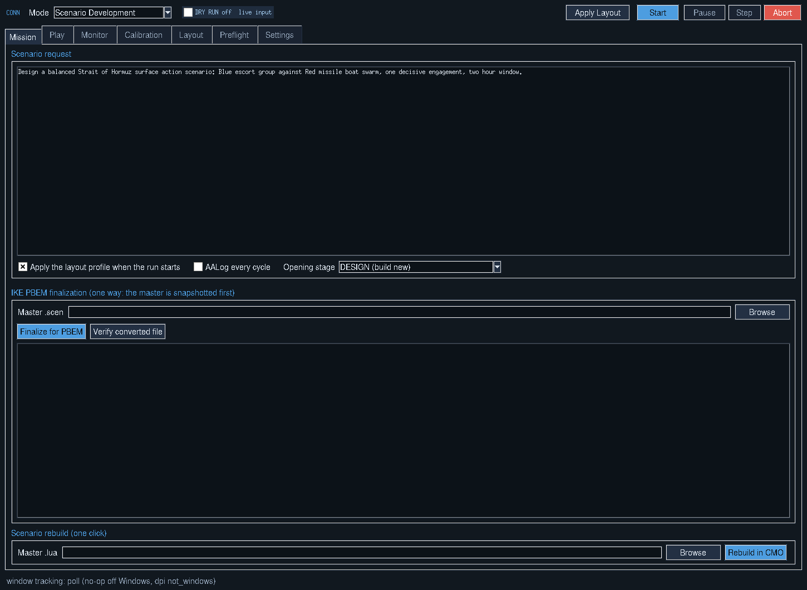

# CMO LLM Bridge

## CONN interface



CONN brings the bridge into one control panel. The header selects the operating
mode and provides Apply Layout, Start, Pause, Step and Abort. Tabs organize the
scenario request, play settings, process monitor, calibration, saved layouts,
Preflight checks and application settings. The blue/dark palette shown above
is **non-dry-run mode**, identified by **DRY RUN off live input** in the header.

CONN includes **help pop-up tooltips**: hover over a control for an explanation
of what it does and how to use it. The Calibration example below shows the
Capture point tooltip.


These are captures of the actual Tkinter interface in a Linux preview session,
with Dry Run off and no automation run started. Windows fonts and window borders
may differ; CMO and chat-window tracking require Windows. Missing-window rows
in the preview are expected because CMO is not running in that session.

## CONN (start here)

`python conn.py` opens CONN, the control surface for everything below:
mode selection, window layout, live calibration, the process monitor, IKE
finalization and the play modes. Full documentation in `docs/CONN.md`.

Quick notes:

- The header holds a **DRY RUN** toggle. While it is on nothing is clicked,
  typed or injected and the whole window is amber.
- Calibration is stored as window-relative anchors, so moving or resizing a
  window no longer breaks it. **Write absolute back** on the Calibration tab
  refreshes the old `coordinates` block for the command-line bridge below.
- The process monitor replaces the bridge console window. Undock it as a
  narrow always-on-top strip from the Monitor tab.
- IKE finalization snapshots the master first and converts a copy, since the
  conversion is one way.

`knowledge_pack/` carries the full v4 CMO Lua knowledge set and the SQLite
DBID extractor, wired into retrieval, an API symbol guard and an AUDIT opening
stage. See `docs/CONN.md` section 6b.

The original command-line bridge and calibration tool still work and read the
same `bridge_config.json`.

---

An LLM-driven bridge for Command: Modern Operations. LLM designs, deploys,
tests, refines, retests, evaluates, and reports on a scenario in one automated
loop, grounded entirely by a local CommandLua library (no online search), with
full play / pause / time-compression / reset / reload control. When a scenario
is finalized it can be converted for head-to-head play with IKE (musurca's
third-party PBEM/hotseat framework), then played turn-by-turn to win against an
opponent by exchanging `.save` files.

Revised from the original Grok bridge. The calibration mechanism, clipboard
copy-with-retry, and CMO popup handling that worked before are preserved; the
driver uses a calibrated LLM chat window with sim-control, RAG and design-loop layers.

## Contents

```
CMO_LLM_Bridge/
├── cmo_lua_llm_bridge_main.py   Main bridge: design-loop state machine + sim control
├── cmo_calibration_ui.py           Calibration UI (LLM points + sim-control points)
├── cmo_rag.py                      Stdlib-only TF-IDF RAG + platform lookup
├── cmo_sim_control.py              Play/pause/compression/lifecycle (Lua + UI-click paths)
├── bridge_config.json              Coordinates, timing, bridge + PBEM settings
├── README.md                       This file
├── docs/
│   └── WORKFLOW.md                 The design loop and PBEM handoff in detail
├── lua_unified/                    Canonical local CommandLua library (reach here, not online)
│   ├── INDEX.md                    Folder manifest
│   ├── cmo_comprehensive_unified_library_v3.md
│   ├── cmo_lookup_library_all_v2.lua
│   ├── cmo_lookup_library_platforms_v2.lua
│   ├── cmo_lookup_library_clean_v2.csv
│   ├── _extract_snippets.py        Regenerates snippets/ from the master reference
│   └── snippets/                   194 topic-tagged recipe blocks + sim-control helpers
└── rag_index/                      Prebuilt RAG indexes (doc_index.json, lookup_index.json)
```

## Complete DB515 data package

The complete supplied DB515 lookup library is included as
[`data/CMO_DB515_FINAL_LOOKUP_LIBRARY.zip`](data/CMO_DB515_FINAL_LOOKUP_LIBRARY.zip).
See [`data/README.md`](data/README.md) for contents, integrity checksum and
how it relates to the existing `knowledge_pack/db515/` retrieval subset.

## Requirements

```
pip install pyautogui pyperclip
```

The RAG (`cmo_rag.py`) and sim-control (`cmo_sim_control.py`) modules are
stdlib-only and need no third-party packages. Local retrieval and CMO control use local files; the chosen LLM chat may require an internet connection.

## LLM naming and configuration

The package, UI, launch script, configuration keys and documentation now use
`LLM` / `llm`. The command-line entry point is `cmo_lua_llm_bridge_main.py`.

For a new installation, run CONN and calibrate the LLM chat window. In `bridge_config.json`, set `windows.llm.title_regex` to text matching your actual chat tab
(the default `LLM` is a placeholder). Configure the attachment method and
hotkey for your chosen chat interface; the existing Ctrl+U default is not
universal. This naming update does not add a provider API integration.

Existing configurations must use the renamed `llm` keys, window identifiers
and layout references. Back up your old configuration before migrating it or
recalibrate a fresh installation. No personal configuration is bundled.

## Quickstart

1. On Windows, install Python with Tkinter and run `pip install -r requirements.txt`.
2. Launch the bridge with **`python conn.py`**.
3. Open the LLM chat, CMO and its Lua console. Follow the
   [layout and calibration guide](docs/SETUP.md) to identify the windows,
   capture your layout and calibrate the six core click targets.
4. Run Preflight checks and rehearse in Dry Run. Switch Dry Run off when the
   configuration is ready, enter the scenario request and press Start.

The older `conn_ui.py` launcher remains available. The separate command-line
entry point is `python cmo_lua_llm_bridge_main.py`. Local retrieval indexes are
built automatically on first use or with `python cmo_rag.py --build`.

## Using the library directly

```
python cmo_rag.py --query  "spawn a raid package when an event fires"
python cmo_rag.py --lookup "F-15C Eagle"
python cmo_rag.py --suggest "Nimitz"
python cmo_rag.py --type   "Submarine"
python cmo_rag.py --feedback "prefer GUIDs when assigning mission targets" --tag missions
```

Feedback notes are ingested into the RAG and retrieved alongside the reference
material in later cycles (the Silent Night feedback-ingestion pattern).

## Notes and caveats

- `VP_RunSimulation` / `VP_PauseSimulation` / `VP_RunForTimeAndHalt` /
  `VP_RunToTimeAndHalt` are Professional Edition functions; the bridge falls
  back to UI-click control when a `VP_` global is missing. `VP_SetTimeCompression`
  is available in the standard branch.
- The lookup layer carries exact names and types but not authoritative DBIDs or
  per-record GUIDs. Resolve DBIDs at runtime and store GUIDs in the keystore.
- IKE PBEM is scaffolded, not auto-run. IKE (github.com/musurca/IKE) is a
  third-party framework that converts a scenario for turn-based multiplayer;
  it is not bundled here. Download the Scenario Author Pack, set
  `pbem.ike_conversion_lua_path`, enable `bridge.pbem_enabled`, and calibrate
  the save/load and IKE end-turn UI points. Play proceeds by exchanging
  `.save` files.
- Lua execution runs real changes against the loaded scenario. Keep a saved
  copy; use a sandbox scenario while iterating.
