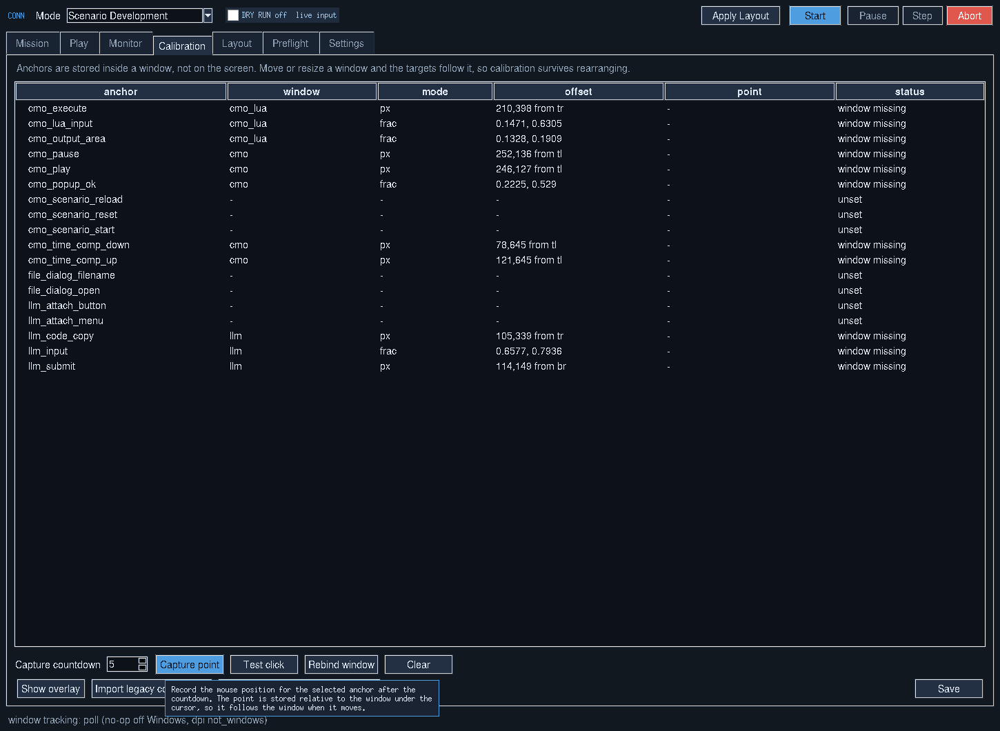

# First-time setup: layout and calibration

Launch the bridge with `python conn.py`. CONN controls a visible LLM chat window
and the CMO Lua console, so it must be calibrated to your own desktop before a
live run. The supplied positions are starting examples, not your calibration.

## 1. Open and identify the windows

Open CMO with a working scenario, its Lua console, your chosen LLM chat and CONN.
Use a separate browser window for the chat so its title and position stay
predictable. Keep the relevant windows visible and unminimized.

Launch CONN once, save its settings and close it. In the generated
`bridge_config.json`, edit `windows.llm.title_regex` to match the actual chat
window title. For example, `ChatGPT` matches a title containing that text. The
shipped `LLM` value is a placeholder. Check `windows.llm.exe_regex` against your
browser executable; the default accepts Edge, Chrome and Firefox. Reopen CONN.
In **Layout → Refresh windows**, confirm that `llm`, `cmo`, `cmo_lua` and `conn`
show the intended window titles and rectangles instead of “not found.”

The separate **Settings → LLM tab must contain** field is an additional chat
safety check; it does not replace the window-detection rule above.

## 2. Arrange and save the layout

Keep **DRY RUN** on during initial setup. Arrange and resize the four windows
as you want to use them. A practical arrangement places the chat above the Lua
console, CMO alongside them and CONN where it does not cover the target controls.
Use your intended browser zoom and Windows display scaling.

In **Layout**, choose **Capture current** and give the profile a recognizable
name such as `Desktop_2_Monitors`. Select the saved profile; the active profile
is marked `*`. Profiles retain the window arrangement for the current monitor
configuration and each operating mode remembers its selected profile.

Use **Apply** to restore that arrangement. The Mission checkbox **Apply the
layout profile when the run starts** restores it automatically before a run.
Layout positions windows; calibration identifies controls inside those windows.

## 3. Capture the six core click targets

On **Calibration**, select one anchor row and press **Capture point**. During
the countdown, move the pointer onto the actual target and hold it there until
capture completes. Repeat for these six anchors:

| Anchor | Place the pointer here |
| --- | --- |
| `llm_input` | Inside the chat message input field |
| `llm_submit` | On the chat Send/Submit button |
| `llm_code_copy` | On the Copy button of a visible Lua code-block response |
| `cmo_lua_input` | Inside the editable CMO Lua script input area |
| `cmo_execute` | On the Lua console Execute/Run button |
| `cmo_output_area` | Inside the Lua console result/output pane |

Have a representative Lua code block visible in the chat before capturing its
Copy button. Keep the input pane and output pane distinct in the CMO console.
Confirm each anchor belongs to `llm` or `cmo_lua`, as appropriate, rather than
`screen` or the wrong window. **Rebind window** lets you change its parent
window. **Save** writes the configuration.

## 4. Calibrate the controls your workflow uses

Capture CMO play/pause and time-compression controls if your run will need the
UI control path. Capture scenario start/reset/reload only when those functions
are required; their defaults are unset. Configure the LLM attachment method in
Settings. If using calibrated attachment controls, capture the attach button,
attach menu and file-dialog anchors. The default Ctrl+U attachment shortcut is
not supported by every chat interface.

## 5. Verify and start

Use **Show overlay** to inspect the anchor markers. Run **Preflight → Run
checks**, resolve the required missing windows/anchors and confirm the chosen
layout. Rehearse in Dry Run first. **Test click** only logs the intended target
while Dry Run is on; with Dry Run off it performs one real click after its
confirmation dialog. A test on Execute or Send can trigger that control.

When the targets are correct, switch Dry Run off. The interface changes from
amber to its blue/dark live palette and the header reads **DRY RUN off live
input**. Choose the operating mode and opening stage, enter the scenario
request and press **Start**. Pause, Step and Abort manage the active run;
`Ctrl+Alt+X` is the default abort shortcut.

## When to check calibration again

Window-relative anchors follow window movement and resize according to their
stored pixel offset or fractional position. Recheck them after changing browser
zoom, Windows scaling, monitor arrangement, chat interface, Lua-console pane
sizes or any control layout. A saved window profile cannot prevent content
inside a browser page from moving. Recapture affected points and save the
updated profile when needed.

## Help pop-up tooltips

Hover over controls to display context-sensitive help pop-up tooltips. These
explain modes, layout capture, calibration, settings and run controls without
leaving CONN. The tooltip appears after a short hover delay and does not take
keyboard focus.
